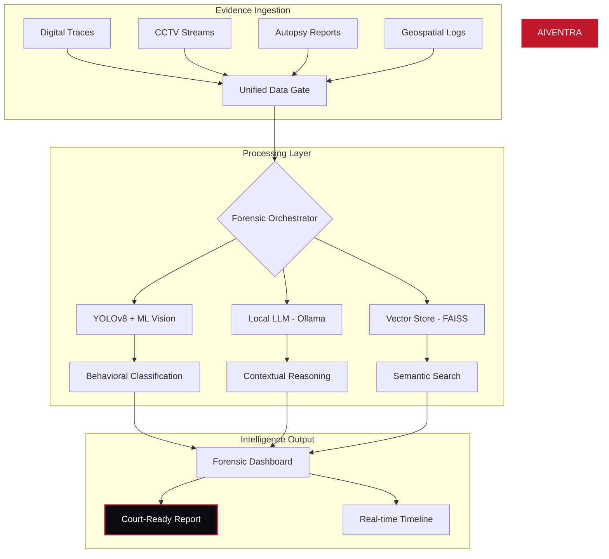
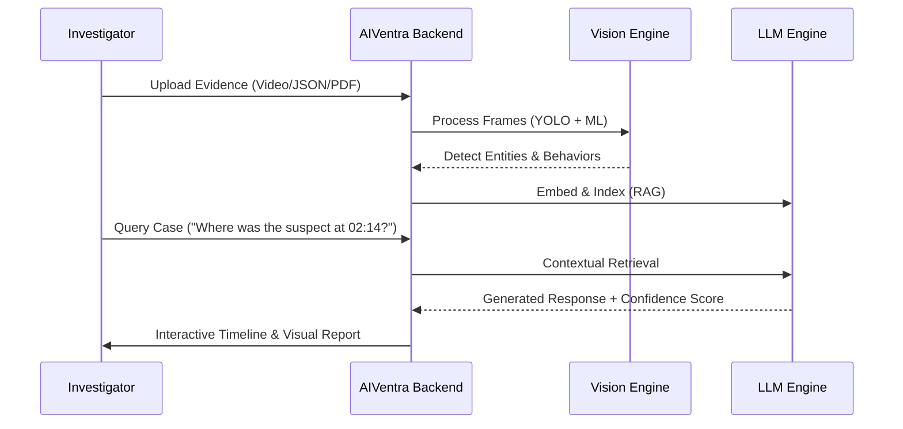

# AIVENTRA: AI-Powered Forensic Intelligence System


[](https://opensource.org/licenses/MIT)
[](https://www.python.org/)
[](https://nextjs.org/)
[](https://ollama.ai/)
[](https://tailwindcss.com/)

**AIVENTRA** is a state-of-the-art forensic triage and postmortem intelligence platform designed for law enforcement and digital forensic units. It leverages localized neural networks, vector-based reasoning, and advanced computer vision to reconstruct crime timelines and detect behavioral anomalies with surgical precision.

---

## 🛡️ Core Intelligence Pillars

### 1. Visual Intelligence (CCTV AI)
Integrates **YOLOv8** for real-time object detection and a custom **MobileNetV2** threat classifier. It doesn't just see objects; it understands *intent*—identifying high-threat behaviors like assault, robbery, or unauthorized access in surveillance feeds.

### 2. Forensic RAG (Local LLM)
Uses **Ollama** (Llama 3 / Mistral) coupled with **FAISS/ChromaDB** to provide a privacy-first, offline-capable knowledge base. Investigators can query thousands of pages of case files, autopsy reports, and logs using natural language.

### 3. Correlation Engine
A high-dimensional graph analysis system that links disparate data points—GPS logs, call metadata, and digital traces—to reveal hidden relationships and temporal overlaps between suspects and locations.

### 4. Automated Triage
Generates court-admissible forensic summaries, reconstructing timelines from raw telemetry and providing AI-assisted verdicts backed by a deterministic reasoning engine.

---

## 📊 System Architecture



---

## 🛠️ Tech Stack & Tools

| Component | Technology | Description |
| :--- | :--- | :--- |
| **Frontend** | Next.js 14, TypeScript, Tailwind | Glassmorphism UI with high-performance rendering |
| **Backend** | FastAPI, Python 3.11 | High-concurrency async forensic pipeline |
| **Intelligence** | Ollama (Llama 3, Mistral) | Local LLM inference for data privacy |
| **Computer Vision** | YOLOv8, OpenCV, PyTorch | Real-time object and behavioral analysis |
| **Vector DB** | FAISS, ChromaDB | High-speed semantic indexing of evidence |
| **Real-time** | WebSockets | Live streaming of analysis progress and telemetry |
| **Styling** | Vanilla CSS, Framer Motion | Premium, dynamic micro-animations |

---

## 🚀 Getting Started

### 1. Clone & Environment
```bash
git clone https://github.com/Anbu-00001/AI-Ventra.git
cd AI-Ventra
```

### 2. Local AI Engine (Ollama)
Ensure Ollama is installed and running, then prime the models:
```bash
chmod +x setup_ollama.sh
./setup_ollama.sh
```

### 3. Backend Setup
```bash
cd backend
python -m venv .venv
source .venv/bin/activate
pip install -r requirements.txt
uvicorn app.main:app --host 0.0.0.0 --port 8000 --reload
```

### 4. Frontend Setup
```bash
cd aiventra
npm install
npm run dev
```

---

## 🔍 Forensic Workflow



---

## 📈 Forensic Dashboard Capabilities

- **Neural Pattern Matching**: Identifying signatures of known criminal tactics.
- **Deep Packet Forensics**: Analyzing digital communication traces.
- **Geospatial Mesh**: Real-time tracking of entities across jurisdictions.
- **Autonomous Case Building**: Self-assembling evidence chains.

---

## 🔮 Future Roadmap

- [ ] **Quantum-Resistant Encryption**: Sealing evidence with post-quantum security.
- [ ] **Predictive Threat Modeling**: Identifying emerging threats before materialization.
- [ ] **Digital Twin Simulation**: 3D reconstruction of crime scenes for forensic walkthroughs.

---

## 📄 License

Distributed under the MIT License. See `LICENSE` for more information.

---

<p align="center">
  <b>Built for the future of justice. Powered by AIVENTRA.</b>
</p>
